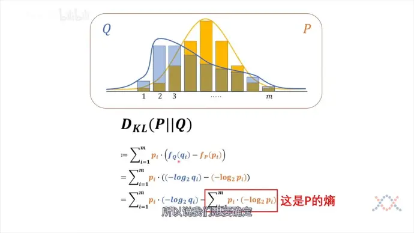
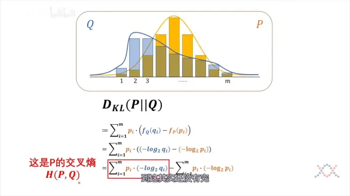
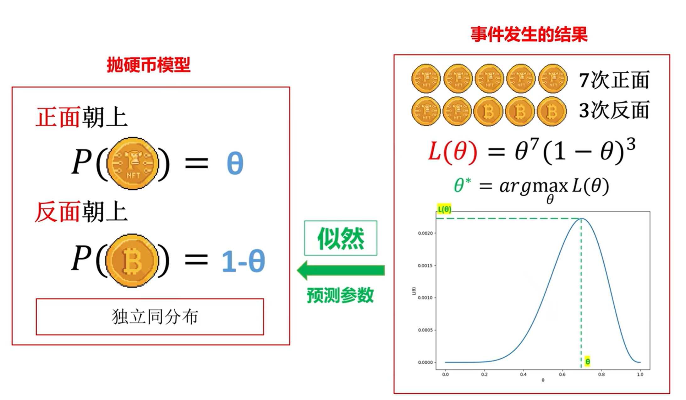
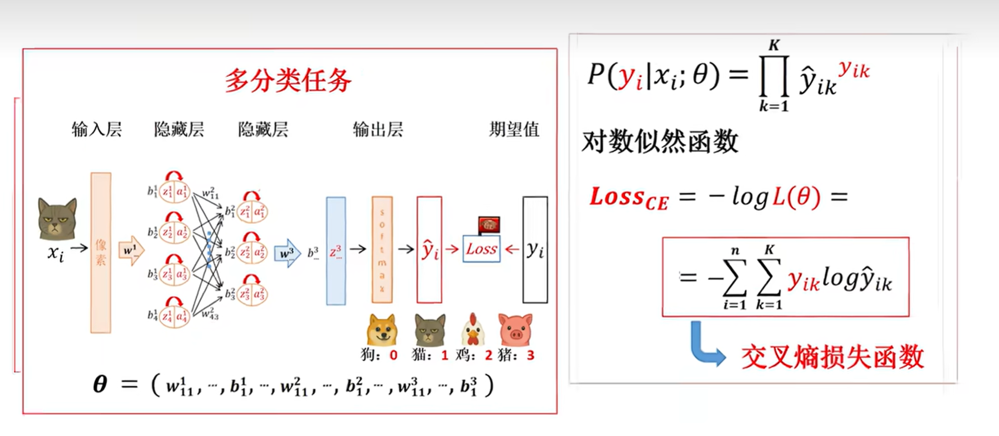

# 信息量、信息熵、KL散度交叉熵损失

## 一、信息量

### **定义**

通过==**概率**==来定义信息量：即一个信息的信息量有多大取决于它**能为我想知道的东西缩小多少概率**，自变量是概率（一个事情发生概率低，那么如果它实现了带来的信息量就多）接下来我们要考虑用数学表达：

由于概率运算为相乘，就有以下关系，而要刻画这种关系的函数就是log

接下来就是确定系数，概率越低信息越大，要乘个负号，底数可以任取，不过在计算机中用二进制比较多就取2为底数，相当于用二进制表达概率，给他个单位即比特
$$
f(x)=-\log_2(x)
$$

## **二、信息熵**

而对于一个系统想要刻画它的信息量是不是把它简单相加呢？并非，如以下例子，右边系统法国队赢得概率很大理论上来说右边更稳定

先前我们计算信息量是**以这个事情发生为前提**的，所以对于一个系统的信息量（信息熵），要给**每个信息量 乘上它的概率**加权求和得到系统信息量（信息熵）

$$
f(p_1,p_2...p_k)=\Sigma_1^k p_i*(-\log_2(p_i))
$$

## **三、相对熵——KL散度**

而对于两个系统，我们希望比较它们的异同，我们使用熵进行刻画

公式中，$D_{KL}(P||Q)$的`||`符号前面是基准，用基准的概率乘各项相差的信息量化简后得到：

**交叉熵(基准概率x另一个的信息量）- 基准熵**的形式

吉布斯不等式：交叉熵>基准熵——》KL散度始终为正数

$p_i$只关乎基准本身，而KL散度取决于交叉熵大小——》使用交叉熵计算损失

**把交叉熵应用到神经网络中**

训练时标签是已知的，只要以真实标签为基准，把得到的分类概率与真实结果算交叉熵损失即可

如：

|          | A    | B    | C    |
| :------: | ---- | ---- | ---- |
| 真实标签 | 1    | 0    | 0    |
| 神经网络 | 0.9  | 0.04 | 0.06 |

$$
D_{KL}(P||Q)=-1*\log_20.9+0+0
$$

（二分类时只要手动分开“是”和“不是”两类即可）

## 四、最大似然估计

利用数据的概率估计最有可能的概率分布（让**已有数据出现的可能性最大**）

数据中进行n次实验，某事件发生了n次，设其概率为$p_i$，则样本数据出现的概率为$p=p_i^k*(1-p_i)^{(n-k)}$

在最外层套个log让相乘变成相加方便求导：$f(p)=k\log_2p_i+(n-k)\log_2(1-p_i)$

发生的次数可替换为频率$q_i$（两边除以总次数）：$f(p)=q_i\log_2p_i+(1-q_i)\log_2(1-p_i)$

使其最大即使其相反数最小——》使交叉熵损失最小

同样的，对于多分类问题可以进行拓展：

